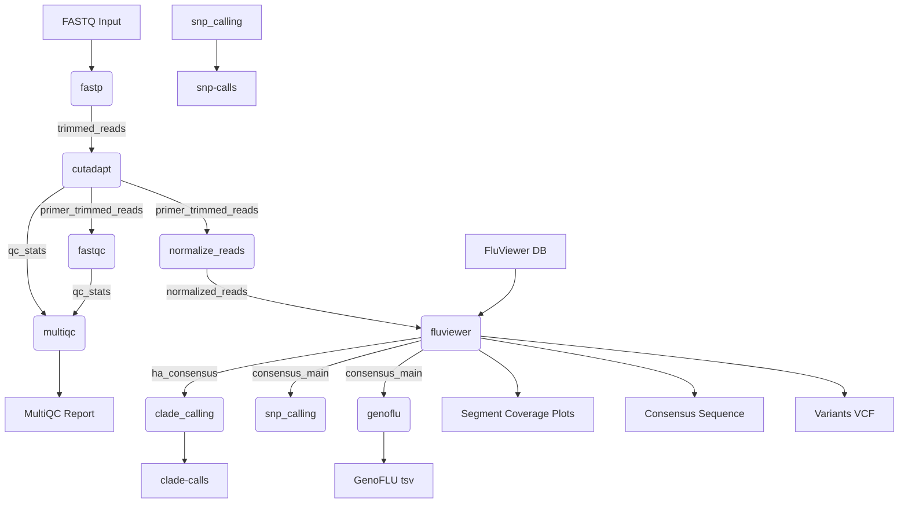

[](https://github.com/BCCDC-PHL/fluviewer-nf/actions/workflows/tests.yml)

# fluviewer-nf

This is a Nextflow pipeline for running the [FluViewer](https://github.com/BCCDC-PHL/FluViewer) analysis tool and other custom modules
to obtain consensus sequences, HA and NA subtypes, clade calls, and amino acid mutations for Influenza A WGS.  

## Analyses

- Read trimming & QC: [fastp](https://github.com/OpenGene/fastp)
- Primer removal with [cutadapt](https://github.com/marcelm/cutadapt)
- FASTQ quality reporting with [FastQC](https://www.bioinformatics.babraham.ac.uk/projects/fastqc/)
- Aggregate the reports with [MultiQC](https://multiqc.info/)
- Sequence analysis with [BCCDC-PHL/FluViewer](https://github.com/BCCDC-PHL/FluViewer)
- Extract HPAI motif (applies to H5 sequences only)
- Clade calls for H1, H3 and H5 influenza using [Nextclade](https://github.com/nextstrain/nextclade)
- Amino acid SNP calls against a specified reference
- Genotype calls using GenoFLU against curated database




## Input

Short read Illumina sequences, files ending in '.fastq.gz', '.fq.gz', '.fastq', '.fq'

## Usage

**Additional requirements for use:**  
- [optional] provide a database for use.  If none is provided the tool should use the database bundled with FluViewer.
  - NOTE: if you choose to use a custom database, you will need to make sure that the sequences and headers are formatted as FluViewer requires.  See https://github.com/BCCDC-PHL/FluViewer for details.
- Package management is via Conda.  In addition, note the `-profile` and `--cache` switches, essential for proper operation of Conda on BCCDC systems.
    - NOTE: if you have problems when first running the pipeline, it can be due to problems resolving the Conda environment.  If this is the case you can use mamba instead.


**Optional arguments:**

For a full list of optional arguments, see: https://github.com/BCCDC-PHL/FluViewer

| Argument              | Description                                                                                      | Default Value   |
|-----------------------|--------------------------------------------------------------------------------------------------|----------------:|
| `--target_depth`      | Depth to normalize coverage to, where sufficient depth is available in inputs.                   |             200 |
| `--min_depth`         | Minimum read depth for base calling.                                                             |              20 |
| `--min_q`             | Minimum PHRED score for base quality and mapping quality.                                        |              20 |
| `--min_cov`           | Minimum coverage of database reference sequence by contig, percentage.                           |              25 |
| `--min_ident`         | Minimum nucleotide sequence identity between database reference sequence and contig (percentage) |              95 |

**Example command:**
```
nextflow run BCCDC-PHL/fluviewer-nf \
  -r v0.3.0 \
  -profile conda \
  --cache ~/.conda/envs \
  --fastq_input /path/to/your_fastqs \
  --db /path/to/FluViewer_db.fa \
  --outdir /path/to/output_dir
```

## Output

Outputs are written to the directory specified with the `--outdir` parameter. Below that are individual folders for each sample, containing the results of FluViewer, SNP calling, and clade calling.

```
<outdir>
├── <run_name>_fluviewer-nf_multiqc_report.html
├── <run_name>_fluviewer-nf_nextflow_report.html
├── <run_name>_fluviewer-nf_nextflow_timeline.html
└── <sample-id>
    ├── <sample-id>.fastp.html
    ├── <sample-id>.fastp.json
    ├── <sample-id>_<date-time>_provenance.yml
    ├── <sample-id>_HA_consensus.fa
    ├── <sample-id>_HPAI.tsv
    ├── <sample-id>_NA_consensus.fa
    ├── <sample-id>_alignment.bam
    ├── <sample-id>_alignment.bam.bai
    ├── <sample-id>_consensus_seqs.fa
    ├── <sample-id>_contigs_blast.tsv
    ├── <sample-id>_depth_of_cov.png
    ├── <sample-id>_fluviewer_provenance.yml
    ├── <sample-id>_genoflu.tsv
    ├── <sample-id>_mapping_refs.fa
    ├── <sample-id>_report.tsv
    ├── <sample-id>_variants.vcf
    ├── clade-calls
    │   ├── <sample-id>_nextclade.aligned.fasta.gz
    │   ├── <sample-id>_nextclade.csv
    │   ├── <sample-id>_nextclade.json
    │   ├── <sample-id>_nextclade.ndjson
    │   ├── <sample-id>_nextclade.tsv
    │   ├── <sample-id>_nextclade_HA1.translation.fasta.gz
    │   ├── <sample-id>_nextclade_HA2.translation.fasta.gz
    │   └── <sample-id>_nextclade_SigPep.translation.fasta.gz
    ├── fluviewer_logs
    │   ├── 01_assemble_contigs
    │   │   ├── spades_stderr.txt
    │   │   └── spades_stdout.txt
    │   ├── 02_blast_contigs
    │   │   ├── blastn_contigs_stderr.txt
    │   │   └── blastn_contigs_stdout.txt
    │   ├── 03_scaffolding
    │   │   ├── blastn_scaffolds_stderr.txt
    │   │   └── blastn_scaffolds_stdout.txt
    │   ├── 04_read_mapping
    │   │   ├── bwa_index_stderr.txt
    │   │   ├── bwa_index_stdout.txt
    │   │   ├── bwa_mem_stderr.txt
    │   │   ├── bwa_mem_stdout.txt
    │   │   ├── samtools_index_stderr.txt
    │   │   ├── samtools_index_stdout.txt
    │   │   ├── samtools_view_stderr.txt
    │   │   └── samtools_view_stdout.txt
    │   ├── 05_variant_calling
    │   │   ├── freebayes_stderr.txt
    │   │   └── freebayes_stdout.txt
    │   ├── 06_consensus_calling
    │   │   ├── bcftools_consensus_stderr.txt
    │   │   ├── bcftools_consensus_stdout.txt
    │   │   ├── bcftools_index_stderr.txt
    │   │   ├── bcftools_index_stdout.txt
    │   │   ├── bcftools_view_stderr.txt
    │   │   └── bcftools_view_stdout.txt
    │   ├── 07_summary_reporting
    │   │   ├── samtools_depth_stderr.txt
    │   │   ├── samtools_depth_stdout.txt
    │   │   ├── samtools_idxstats_stderr.txt
    │   │   └── samtools_idxstats_stdout.txt
    │   ├── fluviewer.log
    │   ├── makeblastdb_contigs_stderr.txt
    │   └── makeblastdb_contigs_stdout.txt
    └── snp-calls
        ├── <sample-id>_HA_mutations.tsv
        ├── <sample-id>_M_mutations.tsv
        ├── <sample-id>_NA_mutations.tsv
        ├── <sample-id>_NP_mutations.tsv
        ├── <sample-id>_NS_mutations.tsv
        ├── <sample-id>_PA_mutations.tsv
        ├── <sample-id>_PB1_mutations.tsv
        ├── <sample-id>_PB2_mutations.tsv
        └── pairwise
```

Output for each sample includes:

| File                        | Description                                                                                |
|-----------------------------|--------------------------------------------------------------------------------------------|
| `*_report.tsv`              | contains assembly and reconstruction metrics for all segments                              |
| `*_consensus_seqs.fa`       | multifasta containing the consesus sequences for each segment                              |
| `*_HA_consensus.fa`         | consensus sequnce for the HA segment (extracted from the multifasta produced by FluViewer) |
| `*_NA_consensus.fa`         | consensus sequnce for the NA segment (extracted from the multifasta produced by FluViewer) |
| `*_depth_of_cov.png`        | line plots describing mapping coverage across all 8 flu segments                           |
| `*_variants.vcf`            | list of mutations in variant call format (VCF) called relative to the reference sequence   |
| `snp-calls/*_mutations.tsv` | tabular list of amino acid SNP mutations relative to the reference                         |
| `genoflu/*_stats.tsv`       | tabular list of genotype call information for the sample's consensus sequences             |

Output for each run includes:

| File                  | Description                                                                     |
|-----------------------|---------------------------------------------------------------------------------|
| `multiqc_report.html` | MultiQC report summarizing the fastp results for the all the samples in the run |


## Provenance files

For each pipeline invocation, each sample will produce a `provenance.yml` file with the following contents.  Note the below is a contrived example.  

```yml
- pipeline_name: BCCDC-PHL/fluviewer-nf
  pipeline_version: 0.3.0
  nextflow_session_id: 59fdd919-fc28-4af5-99e0-60355b11807c
  nextflow_run_name: hopeful_bhaskara
  timestamp_analysis_start: 2024-07-15T16:30:11.150887-07:00
- input_filename: sample-01_R1.fastq.gz
  file_type: fastq_input
  sha256: 2c1d5b310a5ca11cc2b1665c094a064fc3aa597e06f392985dac639bd2ab4d81
- input_filename: sample-01_R2.fastq.gz
  file_type: fastq_input
  sha256: 73745eed4badc3594cdd8554e90c75ae4b9b4599ca255064415ded433e598749
- process_name: fastp
  tools:
    - tool_name: fastp
      tool_version: 0.23.2
- process_name: cutadapt
  tools:
    - tool_name: cutadapt
      tool_version: 4.4
- process_name: normalize_depth
  tools:
    - tool_name: bbnorm
      tool_version: 39.01
- process_name: fluviewer
  tools:
    - tool_name: fluviewer
      tool_version: 0.1.11-6
  databases:
    - database_name: FluViewer_db.fa
      database_path: /path/to/FluViewer_db.fa
      database_sha256: c9ba1af0a637671d86a14aceac3cbfde309ae9a5bd613d75c87ba2ff390b4c48
process_name: nextclade
tools:
  - tool_name: nextclade
    tool_version: 3.8.1
    subcommand: run
- process_name: snp_caling
  tools:
    - tool_name: blastx
      tool_version: 2.15.0+
  databases:
    - database_name: blastx_subtype_db.fasta
- process_name: genoflu
  tools:
    - tool_name: genoflu
      tool_version: 1.03
```
