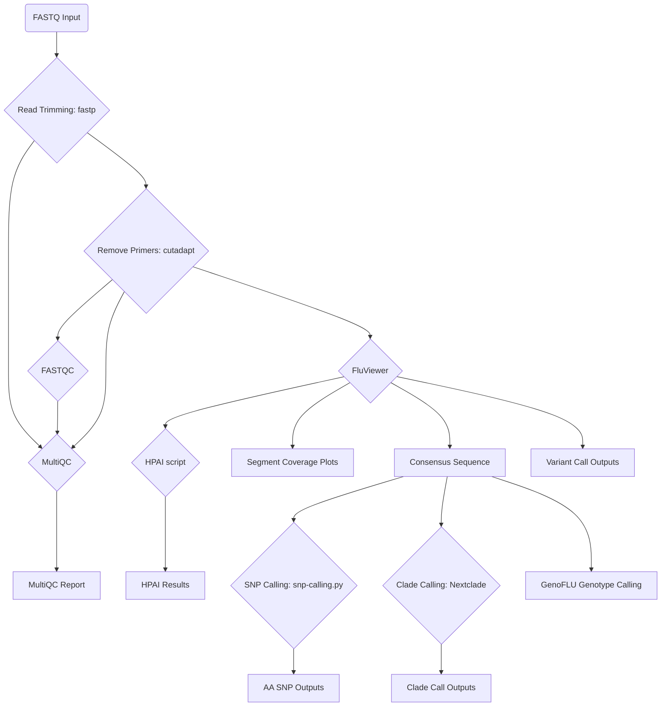

[](https://github.com/BCCDC-PHL/fluviewer-nf/actions/workflows/tests.yml)

# fluviewer-nf

This is a Nextflow pipeline for running the FluViewer analysis tool (https://github.com/KevinKuchinski/FluViewer) and other custom modules to obtain consensus sequences, HA and NA subtypes, clade calls, and amino acid mutations for Influenza A WGS.  

## Analyses

- Read trimming & QC: `fastp`
- Primer removal with `cutadapt`
- FASTQ quality reporting with `FastQC`
- Aggregate the reports with `multiqc`
- Sequence analysis with `FluViewer` 
- Extract HPAI motif (applies to H5 sequences only)
- Clade calls for H1, H3 and H5 influenza using Nextclade (H1 and H3, custom Nextclade for H5 used at BCCDC-PHL)
- Amino acid SNP calls against a specified reference
- Genotype calls using GenoFLU against curated database  




## Input

Short read Illumina sequences, files ending in '.fastq.gz', '.fq.gz', '.fastq', '.fq'

## Usage

**Additional requirements for use:**  
- [optional] provide a database for use.  If none is provided the tool should use the database bundled with FluViewer.
  - NOTE: if you choose to use a custom database, you will need to make sure that the sequences and headers are formatted as FluViewer requires.  See https://github.com/KevinKuchinski/FluViewer for details.
- The runname is parsed from the input to --fastq_input by taking all the characters after the last `/`.  As this requires the input of a folder path, ensure that the folder path does not end in a '/' otherwise you will be returned an error saying that the config file cannot be parsed.
- Package management is via Conda.  In addition, note the `-profile` and `--cache` switches, essential for proper operation of Conda on BCCDC systems.
    - NOTE: if you have problems when first running the pipeline, it can be due to problems resolving the Conda environment.  If this is the case you can use mamba instead.


**Optional arguments:**

For a full list of optional arguments, see: https://github.com/KevinKuchinski/FluViewer

|Argument| Description|
|--------|------------|
| `--min_depth` | Minimum read depth for base calling [default: 20] |
| `--min_q` | Minimum PHRED score for base quality and mapping quality [default: 20]|
| `--min_cov` | Minimum coverage of database reference sequence by contig, percentage [default: 25] |
| `--min_ident` | Minimum nucleotide sequence identity between database reference sequence and contig, percentage [default: 95]|
| `--delete_interfiles` | delete intermediary files, no/yes [default yes]|
| `-L` | Coverage depth limit for variant calling (int, default = 200, min = 1) |


**Example command:**
```
nextflow run BCCDC-PHL/fluviewer-nf \
  -r v0.2.2 \
  -profile conda \
  --cache ~/.conda/envs \
  --fastq_input /path/to/your_fastqs \
  --db /path/to/FluViewer_db.fa \
  --outdir /path/to/output_dir
```

## Output

Output goes to a folder labelled with the run number.  Underneath this is a folder with the name of the FluViewer version (so if this tool is updated with a new version number and run again then there would be multiple folders containing results, one for each version).  
Beneath this level are individual folders for each sample, containing the results of FluViewer, SNP calling, and clade calling.

```
|-Run number
|-----FluViewer_version_output
          |----sample_number
          |       |-----FluViewer outputs
          |       |-----SNP Call outputs
          |       |-----Clade Call outputs
          |       |-----GenoFLU outputs
          |----sample_number
          |       |-----FluViewer outputs
          |       |-----SNP Call outputs
          |       |-----Clade Call outputs
          |       |-----GenoFLU outputs
          | ...
          |----Provenance_files
          |----sample_number_multiqc_report.html
          |----sample_number_report.html
          |----sample_number_timeline.html
```

Output for each sample includes:

| File | Description|
|----------|----------------|
|`*_report.tsv`|contains assembly and reconstruction metrics for all segments|
|`*_consensus_seqs.fa`| multifasta containing the consesus sequences for each segment|
|`*_HA_consensus.fa` |consensus sequnce for the HA segment (extracted from the multifasta produced by FluViewer)|
|`*_NA_consensus.fa` |consensus sequnce for the NA segment (extracted from the multifasta produced by FluViewer)|
|`*_depth_of_cov.png` | line plots describing mapping coverage across all 8 flu segments|
|`*_variants.vcf` | list of mutations in variant call format (VCF) called relative to the reference sequence |
|`snp-calls/*_mutations.tsv` | tabular list of amino acid SNP mutations relative to the reference |
|`genoflu/*_stats.tsv` | tabular list of genotype call information for the sample's consensus sequences |

Output for each run includes:

| File | Description|
|----------|----------------|
|`multiqc_report.html`| MultiQC report summarizing the fastp results for the all the samples in the run |


## Provenance files

For each pipeline invocation, each sample will produce a `provenance.yml` file with the following contents.  Note the below is a contrived example.  

```yml
- pipeline_name: BCCDC-PHL/FluViewer-nf
  pipeline_version: 0.2.2
  timestamp_analysis_start: 2023-11-21T05:43:25.541743
- input_filename: {Sample}_R1.fastq.gz
  input_path: /home/{USER{}}/Flu/test_data/test_production_run/{Sample}_R1.fastq.gz
  sha256: 47380e49f10374660a2061d3571efe5339401484e646c2b47896fa701dbcf0a8
- input_filename: {Sample}_R2.fastq.gz
  input_path: /home/{USER}/Flu/test_data/test_production_run/{Sample}.fastq.gz
  sha256: 39c95fd26af111ee9a6caeb840a7aced444b657550efea3ab7f74add0b30f69d
- process_name: fastp
  tools:
    - tool_name: fastp
      tool_version: 0.23.1
- process_name: cutadapt
  tools:
    - tool_name: cutadapt
      tool_version: 4.1
- process_name: fluviewer
  tools:
    - tool_name: FluViewer
      tool_version: FluViewer v0.0.2
  databases:
    - database_name: FluViewer_db_full_20220915.fasta
      database_path: /home/{USER}/Flu/ref/FluViewer_db_full_20220915.fasta
      database_sha256: 55b33afa21ad44ed1e6db896cf420fae6b1524c0ad205775a1ce9dd11595905d

- process_name: nextclade
  tool_name: nextclade
  tool_version: 2.9.1
  Dataset location: /scratch/{USER}/flu/nextclade_datasets/nextclade_flu_h5nx_ha/
  Dataset version:   "tag": "2023-04-02T12:00:00Z"
```
